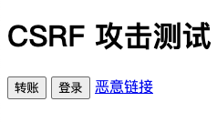

# CSRF 攻击演示过程

## 服务启动

1. 启动 java 程序 CsrfDemoApplication，该 Spring Boot 服务将在 8080 端口提供服务；

2. 通过 npm 安装 http-server，进入 malicious-web 文件夹, 通过 `http-server . -p 18080` 启动攻击者网站;

## 演示

通过 http://localhost:8080 访问目标网站。

### 正常访问

1. 如果直接点击 "转账" 按钮，将弹出提示框，提示 **没有登录** ；
2. 如果点击 "登录"，弹出提示框，提示 **登录成功**，之后点击转账，提示 **转账成功**，并且在后端打印 **给fhb转账100元**；
3. 在第2步的基础上，点击 "恶意连接"，将跳转到攻击者网站，并且在后端打印 **给fff转账10元**，表示攻击成功。

